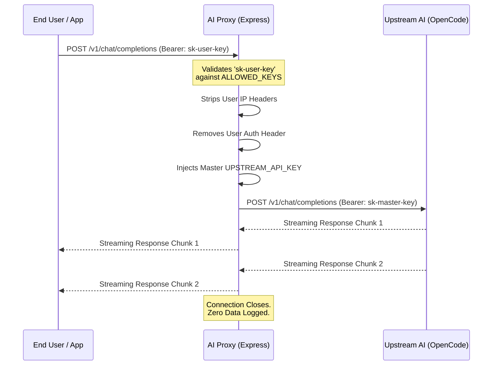

<h1 align="center">
  
</h1>

<p align="center">
  
</p>

<p align="center">
  <a href="https://github.com/SUDEEPBOTS/ai-proxy/stargazers"></a>
  <a href="https://github.com/SUDEEPBOTS/ai-proxy/network/members"> </a>
  <a href="https://github.com/SUDEEPBOTS/ai-proxy/issues"> </a>
  <a href="https://github.com/SUDEEPBOTS/ai-proxy/blob/main/LICENSE"></a>
</p>

<p align="center">
  
</p>

---

## 📖 Table of Contents

1. [Introduction](#-introduction)
2. [Awesome Features](#-awesome-features)
3. [Architecture Overview](#-architecture-overview)
4. [One-Click Deployment](#-one-click-deployment)
5. [Local Development](#-local-development)
6. [API Usage & Integration](#-api-usage--integration)
7. [Environment Configuration](#-environment-configuration)
8. [Security & Privacy](#-security--privacy)
9. [Troubleshooting & FAQ](#-troubleshooting--faq)
10. [Support](#-support)

---

## 🌟 Introduction

**AI Proxy Node** is a highly optimized reverse proxy for AI APIs (like OpenCode or OpenAI). In an era where upstream providers heavily monitor IP addresses and rate limits, this proxy serves as an impenetrable middleware layer. It ensures complete anonymity by stripping client IPs and handling dynamic key substitution in memory.

If you are running an AI SaaS, a Chatbot, or any application that heavily relies on LLMs, exposing your Master API Key to the client is a massive security risk. **AI Proxy Node** solves this by letting you issue custom sub-keys to your users, validating them at the edge, and silently injecting your master key before forwarding the request.

---

## ⚡️ Awesome Features

- **🔥 100% Stateless Architecture:** There are no databases to maintain, no Redis instances to pay for, and no caching mechanisms that could leak data. Everything exists solely in the RAM of the Node.js process during the lifespan of the HTTP request.
- **🛡️ Ultimate IP Privacy:** The proxy aggressively strips `x-forwarded-for`, `x-real-ip`, and other identifying headers. Upstream providers will NEVER see your users' IPs, only the IP of the proxy server.
- **✨ Smart Key Injection:** Validates user API keys at the edge, removes them from the headers, and silently replaces them with your master `UPSTREAM_API_KEY`.
- **🚀 Blazing Fast:** Built on Express.js and `http-proxy-middleware`, it introduces less than 5ms of latency and fully supports Server-Sent Events (SSE) for instant token streaming.
- **🐳 Cloud Ready:** Designed specifically for containerized environments. It works perfectly on Railway, Heroku, Render, AWS, and DigitalOcean.

---

<p align="center">
  
</p>

## 🏗 Architecture Overview

The following diagram explains how a request flows from your User to the Upstream AI Provider.



---

<p align="center">
  
</p>

## 🚀 One-Click Deployment

Deploying AI Proxy Node is incredibly simple. It requires zero setup and no external databases.

<h3 align="center">☁️ Deploy on Cloud ☁️</h3>

<p align="center">
<a href="https://dashboard.heroku.com/new?template=https://github.com/SUDEEPBOTS/ai-proxy">
  
</a>
<a href="https://render.com/deploy?repo=https://github.com/SUDEEPBOTS/ai-proxy">
  
</a>
<br>
<a href="https://railway.app/template?gh_repo=SUDEEPBOTS/ai-proxy">
  
</a>
</p>

### Deployment Steps:
1. Click one of the deployment buttons above.
2. The platform will read the `app.json` or `railway.json` file.
3. You will be prompted to enter your `UPSTREAM_API_KEY` (Your real Master Key).
4. You will be prompted to enter your `ALLOWED_KEYS` (The keys you want to issue to users).
5. Deploy and get your live URL instantly!

---

<p align="center">
  
</p>

## 💻 Local Development

If you wish to test the proxy locally on your machine or deploy it manually to a VPS, follow these steps:

### Prerequisites
- Node.js (v18 or higher)
- NPM (v8 or higher)
- Git

### Installation Steps

**1. Clone the Repository:**
```bash
git clone https://github.com/SUDEEPBOTS/ai-proxy.git
cd ai-proxy
```

**2. Install Dependencies:**
```bash
npm install
```

**3. Configure Environment Variables:**
Create a `.env` file in the root directory and add your credentials:
```env
# Your real upstream API key
UPSTREAM_API_KEY=sk-your-real-upstream-key-here

# Keys you want to allow (Comma separated)
ALLOWED_KEYS=sk-sudeep,sk-test-123,sk-dev
```

**4. Start the Server:**
```bash
# For standard execution
npm start

# For development with auto-reload (requires nodemon)
npx nodemon server.js
```

The server will start on `http://localhost:3000`.

---

<p align="center">
  
</p>

## 📞 API Usage & Integration

Once deployed, your proxy acts exactly like the official OpenAI API. You do not need to learn any new syntax or endpoints. 

### 1. Using cURL (Terminal)
```bash
curl -X POST https://your-app.up.railway.app/v1/chat/completions \
  -H "Content-Type: application/json" \
  -H "Authorization: Bearer sk-sudeep" \
  -d '{
    "model": "deepseek-v4-flash-free",
    "messages": [
      {"role": "system", "content": "You are a helpful assistant."},
      {"role": "user", "content": "Explain reverse proxies."}
    ],
    "stream": true
  }'
```

### 2. Using Python (Official OpenAI SDK)
```python
import os
from openai import OpenAI

# Initialize the client pointing to your deployed proxy
client = OpenAI(
    api_key="sk-sudeep", # Your allowed sub-key
    base_url="https://your-app.up.railway.app/v1", # Your proxy URL
)

response = client.chat.completions.create(
    model="deepseek-v4-flash-free",
    messages=[
        {"role": "user", "content": "Hello, how are you?"}
    ]
)

print(response.choices[0].message.content)
```

### 3. Using Node.js (Official OpenAI SDK)
```javascript
import OpenAI from "openai";

const openai = new OpenAI({
  apiKey: "sk-sudeep", // Your allowed sub-key
  baseURL: "https://your-app.up.railway.app/v1" // Your proxy URL
});

async function main() {
  const completion = await openai.chat.completions.create({
    messages: [{ role: "user", content: "What is quantum computing?" }],
    model: "deepseek-v4-flash-free",
  });

  console.log(completion.choices[0].message.content);
}

main();
```

---

<p align="center">
  
</p>

## ⚙️ Environment Configuration

| Variable | Description | Required | Default |
| :--- | :--- | :---: | :--- |
| `UPSTREAM_API_KEY` | Your master key for the upstream provider. | Yes | `your_secret_upstream_key` |
| `ALLOWED_KEYS` | Comma-separated list of keys authorized to use your proxy. | Yes | `sk-sudeep` |
| `PORT` | The port the Express server will listen on. | No | `3000` |

*Note: If deploying on Heroku, Render, or Railway, the `PORT` variable is automatically injected by the cloud provider.*

---

<p align="center">
  
</p>

## 🔐 Security & Privacy

### Header Stripping
When a user connects to your proxy, their HTTP request contains metadata, including their IP address. Upstream providers use this to rate-limit or ban users.
**AI Proxy Node** explicitly deletes the following headers before forwarding:
- `x-forwarded-for`
- `x-real-ip`
- `forwarded`
- `x-forwarded-host`
- `x-forwarded-proto`

This guarantees that the Upstream AI only sees the IP address of your Cloud Server (Railway/Heroku), providing absolute anonymity for your end-users.

### In-Memory Key Substitution
Your `UPSTREAM_API_KEY` is loaded into memory when the server starts. When a request comes in, the proxy verifies the user's key, deletes the user's `Authorization` header, and injects your master key. The proxy does **not** log the master key to the console, protecting you against accidental leaks in your server logs.

---

<p align="center">
  
</p>

## ❓ Troubleshooting & FAQ

**Q: I am getting a `401 Unauthorized` error.**
A: Ensure that the API key you are passing in your client code exists in the `ALLOWED_KEYS` string in your `.env` file. If you are using multiple keys, ensure they are separated by commas without spaces (e.g. `key1,key2`).

**Q: Does this support streaming responses?**
A: Yes! `http-proxy-middleware` natively supports Server-Sent Events (SSE). If you pass `stream: true` in your API request, the proxy will pipe the chunks directly to your client with zero delay.

**Q: Can I change the upstream URL?**
A: Yes. In `server.js`, you can modify the `UPSTREAM_URL` constant to point to OpenAI, Anthropic, or any other OpenAI-compatible API endpoint.

**Q: Why does the server log show `[DEBUG]` messages?**
A: Debug logs are included by default so you can verify incoming requests and key substitutions. If you are deploying to high-traffic production, you can safely delete the `console.log` statements in `server.js` to save CPU cycles.

---

<p align="center">
  
</p>

## 📞 Support

If you encounter any issues or have feature requests, please join our Telegram support group or open an issue on GitHub.

<p align="center">
  <a href="https://t.me/Zcziiyy"></a>
</p>

<br>

<p align="center">
  
</p>
